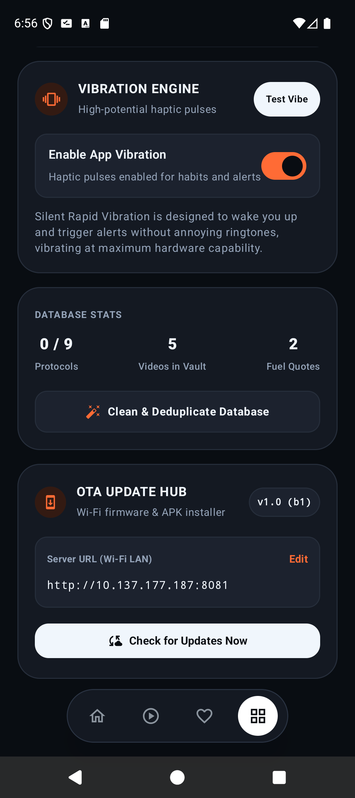
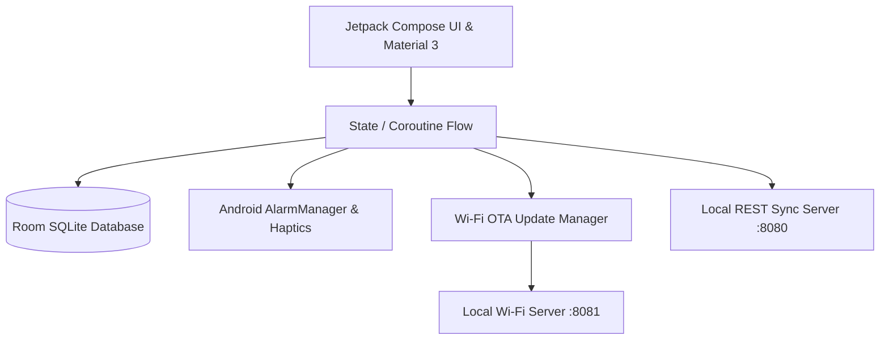

<div align="center">


# DisciplineOS
### *The Relentless High-Performance Routine & Protocol Engine for Android*

[](https://android.com)
[](https://kotlinlang.org)
[](https://developer.android.com/jetpack/compose)
[](https://developer.android.com/training/data-storage/room)
[](#-in-app-wi-fi-auto-update-engine)
[](#-privacy--security)

<br/>

**DisciplineOS** is an unapologetic, luxury-grade routine execution system engineered for unyielding daily consistency. Combining strict chronological timeline algorithms, an interactive digital clock studio, a YouTube educational vault, motivational fuel vows, and silent haptic vibration alerts, DisciplineOS is built for those who execute without excuses.

</div>

---

## 📱 Google Play Store Showcase

<div align="center">
<table>
  <tr>
    <td align="center" width="33%">
      <b>🌅 Chronological Protocols</b><br/><br/>
      <br/>
      <i>Strict morning-to-night timeline: 07:15 AM push-ups strictly prioritized before 07:30 AM coding & 08:45 AM college.</i>
    </td>
    <td align="center" width="33%">
      <b>⏰ Luxury Clock Studio</b><br/><br/>
      <br/>
      <i>Full-screen live digital clock with routine presets (5:27 AM, Bedtime), 12h/24h conversion & haptic toggle.</i>
    </td>
    <td align="center" width="33%">
      <b>🎬 Video Knowledge Vault</b><br/><br/>
      <br/>
      <i>Save tutorials directly via Android Share Intent, schedule study reminders & track completed videos.</i>
    </td>
  </tr>
  <tr>
    <td align="center" width="33%">
      <b>🔥 Fuel & Defiance Mode</b><br/><br/>
      <br/>
      <i>Convert past doubts, incidents, and setbacks into raw fuel and unshakeable daily vows.</i>
    </td>
    <td align="center" width="33%">
      <b>📳 Haptic Vibration & Sync</b><br/><br/>
      <br/>
      <i>Silent rapid vibration engine, database deduplication, REST API gateway & hardware settings.</i>
    </td>
    <td align="center" width="33%">
      <b>🚀 Wi-Fi In-App Auto-Update</b><br/><br/>
      <br/>
      <i>Instant over-the-air firmware updates: release notes, live download bar & one-tap Android installer.</i>
    </td>
  </tr>
</table>
</div>

---

## ✨ Key Features & Capabilities

### 1. 🌅 Strict Chronological Protocol Pipeline
* **Natural Time Sorting**: Automatically sequences morning, afternoon, college, evening, and bedtime routines by exact minute (e.g., 07:15 AM physical push-ups strictly prioritized before 07:30 AM deep coding).
* **Smart Routine Presets**: Includes pre-configured college lectures & lab practice routines (08:45 AM), coding sprints, hydration intervals, and sleep protocols.
* **Granular Subtask Checklists**: Break high-priority protocols into actionable subtasks with progress tracking.
* **Auto-Reset Engine**: Automatically resets protocol completion states every midnight or on demand.

### 2. ⏰ Interactive Luxury Clock Studio
* **Edge-to-Edge Full-Screen Modal**: Built with zero background leakage and dynamic navigation insets that adapt flawlessly to both gesture and 3-button navigation.
* **Live Digital Time Display**: Interactive glowing digital clock showing exact hours, minutes, and AM/PM indicators.
* **One-Tap Quick Routine Chips**: Fast selection for custom morning alarms (05:27 AM), workout sessions (07:15 AM), and bedtime wind-downs (08:27 PM).

### 3. 🎬 Video Knowledge Vault & Study Engine
* **Android System Share Integration**: Share any video link directly from the YouTube app into DisciplineOS with automatic title extraction.
* **Flexible Study Alarms**: Set instant study reminders ("In 1 Hour", "Tonight at 8 PM", "Tomorrow Morning", or custom date/time).
* **Watched Archive**: Separate active study backlog from finished mastery videos.

### 4. 🔥 Fuel Quotes & Defiance Mode
* **Emotional Anchoring**: Log incidents, doubts from others, and personal vows into distinct categories (`Defiance`, `Self-Discipline`, `Legacy`).
* **Instant Fuel Card**: Randomly or sequentially view your strongest defiance vows whenever motivation dips.

### 5. 📳 Silent Rapid Vibration Hardware Engine
* **Maximum Hardware Potential**: Silent, high-intensity haptic vibration pulses designed to wake you up or signal habit transitions without noisy ringtones.
* **Master Hardware Switch**: Dedicated toggle in System Settings with a live "Test Vibe" diagnostic button.

### 6. 🚀 In-App Wi-Fi Auto-Update Engine (OTA Update Hub)
* **Automatic Launch Discovery**: When connected to local Wi-Fi, DisciplineOS pings the local manifest (`update.json` on port 8081).
* **Luxury Update Dialog**: Displays current vs. remote version badges, categorized release notes, and download progress.
* **One-Tap Installation**: Streams the APK over Wi-Fi, generates secure Android `FileProvider` URIs, and immediately triggers the native Android package installer.
* **Manual Hub in Settings**: View your active build badge (`v2.0.0 (b2)`), change local server IPs on the fly, and test update availability manually.

---

## 🛠️ Architecture & Tech Stack



* **Language**: 100% Kotlin 2.0
* **UI Framework**: Jetpack Compose & Material 3 (Custom Obsidian / TripGlide Dark & Light Design System)
* **Database**: Room SQLite with automatic migration and deduplication algorithms
* **Asynchrony**: Kotlin Coroutines & StateFlow
* **Package Management & Updates**: Native Android `FileProvider` + `REQUEST_INSTALL_PACKAGES`
* **Network Traffic**: Local HTTP Cleartext enabled for zero-friction private Wi-Fi synchronization

---

## 📥 Building & Installing

### Prerequisites
* Android Studio Ladybug / Koala or Android SDK Platform-Tools 35+
* JDK 21+

### Build Debug APK
```bash
# Clone the repository
git clone https://github.com/Developer-For-Git/DisciplineOS.git
cd DisciplineOS

# Compile and assemble APK
./gradlew assembleDebug
```
The compiled APK will be located at:
```text
app/build/outputs/apk/debug/app-debug.apk
```

### Install via ADB
```bash
adb install -r app/build/outputs/apk/debug/app-debug.apk
```

---

## 🔒 Privacy & Security

* **100% Offline-First**: All your protocols, video notes, and fuel quotes reside strictly in local SQLite storage on your physical device.
* **Zero Telemetry**: No third-party analytics, tracking SDKs, or cloud telemetry.
* **Private Wi-Fi Only**: Over-the-air updates communicate only with your specified local PC server address on your trusted home Wi-Fi network.

---

<div align="center">
  <sub>Built with relentless discipline by <b>Developer-For-Git</b></sub>
</div>
