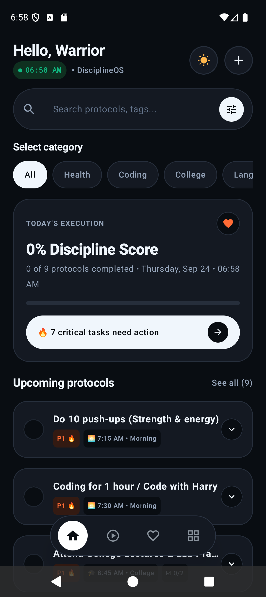
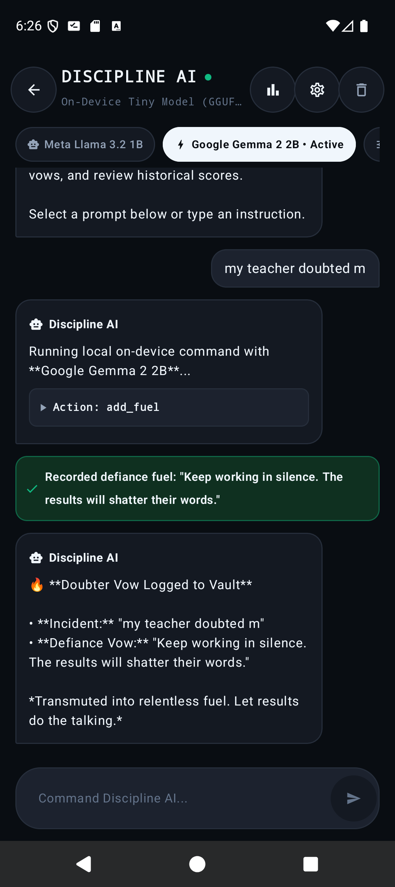
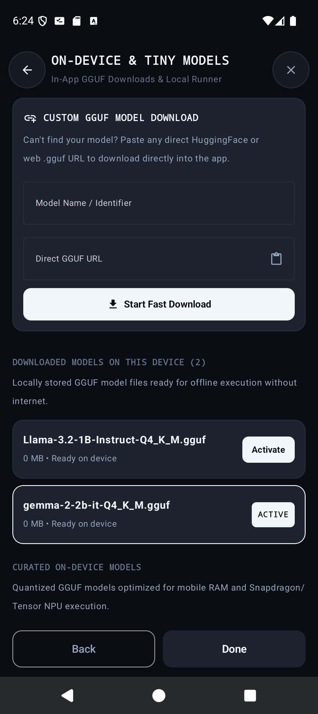
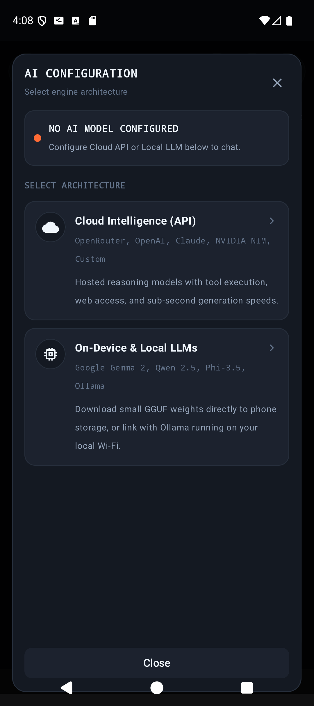
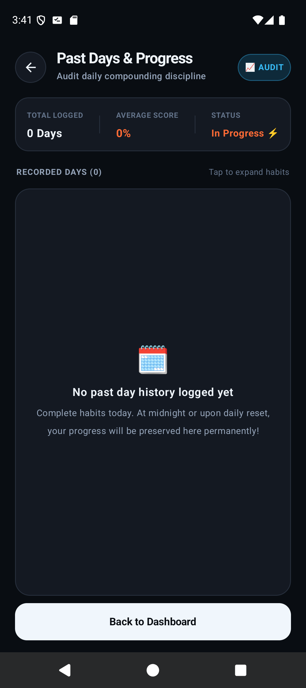
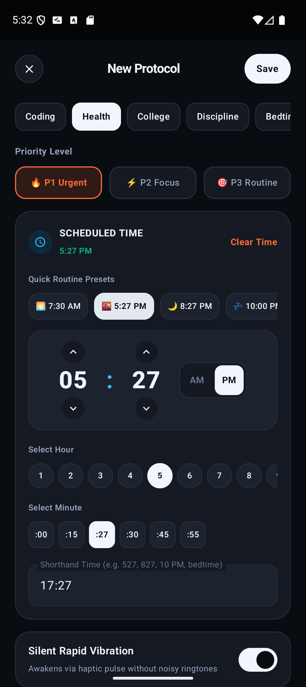
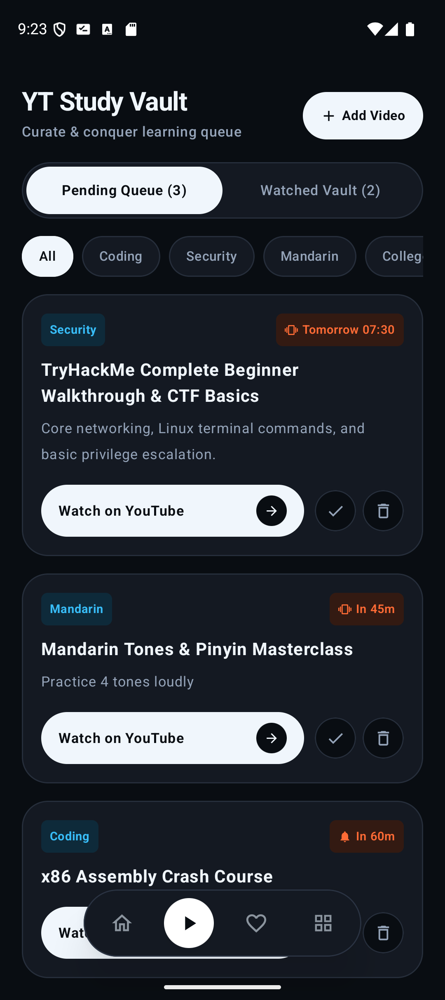
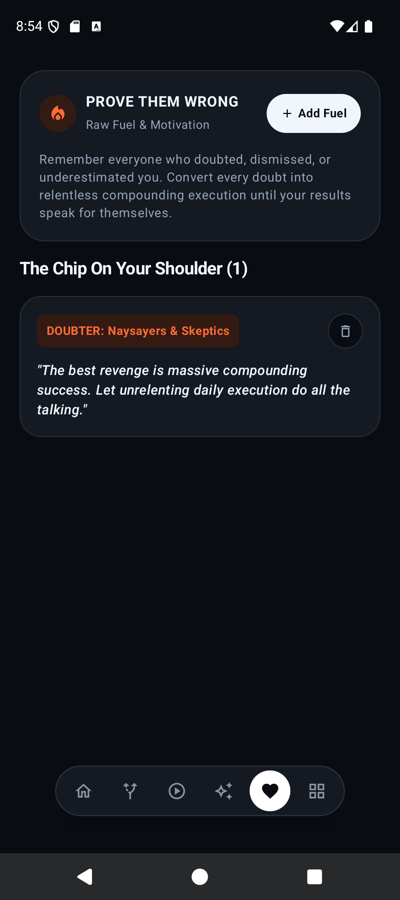
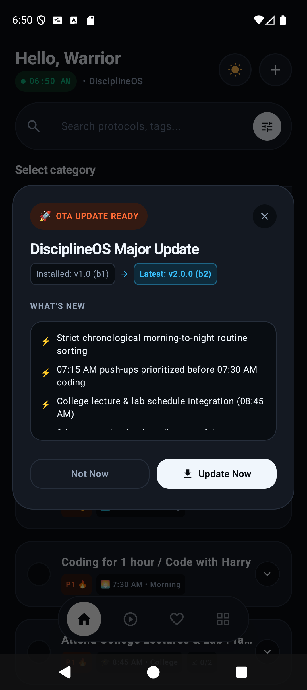
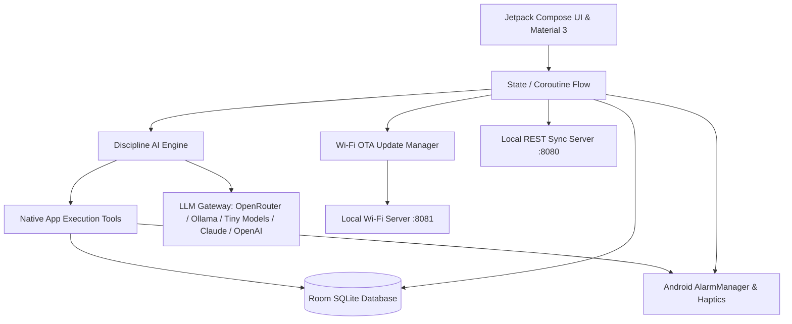

<div align="center">


# DisciplineOS
### *The Relentless High-Performance Routine & Protocol Engine for Android*

[](https://android.com)
[](https://kotlinlang.org)
[](https://developer.android.com/jetpack/compose)
[](#-discipline-ai-autonomous-agent)
[](https://developer.android.com/training/data-storage/room)
[](#-in-app-wi-fi-auto-update-engine)
[](#-privacy--security)

<br/>

**DisciplineOS** is an unapologetic, luxury-grade routine execution system engineered for unyielding daily consistency. Combining an autonomous in-app AI agent with direct database execution tools, support for on-device tiny models (Google Gemma, Meta Llama) and cloud APIs, strict chronological timeline algorithms, an interactive digital clock studio, a YouTube educational vault, motivational fuel vows, and silent haptic vibration alerts, DisciplineOS is built for those who execute without excuses.

</div>

---

## 📱 Visual Showcase & Architecture

<div align="center">
<table>
  <tr>
    <td align="center" width="33%">
      <b>🌅 Chronological Protocols</b><br/><br/>
      <br/>
      <i>Natural timeline with 5-tab stadium capsule dock, header AI launcher & 07:15 AM push-ups strictly prioritized before 07:30 AM coding.</i>
    </td>
    <td align="center" width="33%">
      <b>🤖 Discipline AI Autonomous Agent</b><br/><br/>
      <br/>
      <i>Full-screen dedicated AI workspace with direct app integration, quick action chips, top history/settings navigation & pure monochrome OLED styling.</i>
    </td>
    <td align="center" width="33%">
      <b>🧠 Tiny Mobile Models Catalog</b><br/><br/>
      <br/>
      <i>Run lightweight models locally on phone or Wi-Fi (Google Gemma 2 2B, Meta Llama 3.2 1B & 3B) via Ollama/GGUF with one-tap configuration.</i>
    </td>
  </tr>
  <tr>
    <td align="center" width="33%">
      <b>⚙️ AI Models & Cloud APIs</b><br/><br/>
      <br/>
      <i>Multi-provider gateway: OpenRouter (free Gemini 2.0 Flash), OpenAI, Anthropic Claude, Ollama LAN, NVIDIA NIM & custom local endpoints.</i>
    </td>
    <td align="center" width="33%">
      <b>📊 Past Days & Progress Audit</b><br/><br/>
      <br/>
      <i>Permanent daily compounding discipline audit: historical scores, completed routines count & streak preservation.</i>
    </td>
    <td align="center" width="33%">
      <b>⏰ Luxury Clock Studio</b><br/><br/>
      <br/>
      <i>Full-screen live digital clock with routine presets (5:27 AM, Bedtime), 12h/24h conversion & haptic toggle.</i>
    </td>
  </tr>
  <tr>
    <td align="center" width="33%">
      <b>🎬 Video Knowledge Vault</b><br/><br/>
      <br/>
      <i>Save tutorials directly via Android Share Intent, schedule study reminders & track completed videos.</i>
    </td>
    <td align="center" width="33%">
      <b>🔥 Fuel & Defiance Mode</b><br/><br/>
      <br/>
      <i>Convert past doubts, incidents, and setbacks into raw fuel and unshakeable daily vows.</i>
    </td>
    <td align="center" width="33%">
      <b>🚀 Wi-Fi In-App Auto-Update</b><br/><br/>
      <br/>
      <i>Instant over-the-air firmware updates: release notes, live download bar & one-tap Android installer.</i>
    </td>
  </tr>
</table>
</div>

---

## ✨ Key Features & Capabilities

### 1. 🤖 Discipline AI Autonomous Agent & In-App Execution
* **Direct Application Integration**: Unlike generic chat bots, Discipline AI has direct access to the app's internal Room SQLite database, AlarmScheduler, and vibration hardware via structured function calls.
* **Top Model Switcher Bar**: Instantly swap between active and downloaded on-device models (e.g. Meta Llama 3.2 1B, Google Gemma 2 2B) directly from a horizontal switcher pinned to the top of the chat area.
* **Autonomous Protocol Execution**:
  * Query routines by date, priority, or time (`get_daily_protocols`).
  * Mark protocols completed or toggle status instantly (`toggle_protocol_status`).
  * Add or reschedule routines on the fly (`add_protocol`, `reschedule_protocol`).
  * Add defiance quotes directly to your motivational fuel stash (`add_fuel_vow`).
  * Trigger hardware vibration diagnostic sweeps (`test_vibration`).
  * Audit past days' discipline scores and completion percentages (`get_past_history`).
* **Clean Structured Markdown Responses**: Pure human-readable Markdown formatting without raw JSON code dumps, backed by realistic progressive on-device tensor evaluation pacing.
* **Full-Screen Workspace**: When opened, the bottom dock automatically unmounts to provide maximum screen real estate. The top header features a back button to return to the dashboard, a direct shortcut to historical performance records, model settings, and chat reset.
* **Monochrome Professional Aesthetic**: Stripped of distracting emoji clutter and inconsistent accent colors; follows DisciplineOS's strict dark slate OLED design language.

### 2. 🧠 On-Device Tiny Models & Multi-Provider LLM Gateway
* **Local / On-Device Tiny Models Catalog**: Run offline without sending data to third parties. Automatically scans device storage and downloads directory for `.gguf` weights with 1-tap activation:
  * **Google Gemma 2 2B Instruct** (1.6 GB, Q4_K_M): High precision, fast mobile inference.
  * **Meta Llama 3.2 1B Instruct** (800 MB, Q4_K_M): Ultra-lightweight edge model.
  * **Meta Llama 3.2 3B Instruct** (2.0 GB, Q4_K_M): Powerful on-device reasoning and schedule extraction.
  * **Custom GGUF Downloader**: Direct download manager supporting custom HuggingFace or direct web links with progress bar and instant offline activation.
* **Flexible Cloud Providers**:
  * **OpenRouter** (Default: `google/gemini-2.0-flash-exp:free` for fast, zero-cost intelligence).
  * **OpenAI** (`gpt-4o-mini`).
  * **Anthropic Claude** (`claude-3-5-haiku-20241022`).
  * **Ollama** (Local Wi-Fi PC server: `gemma2:2b` or custom models).
  * **NVIDIA NIM** (`meta/llama-3.3-70b-instruct`).
  * **Custom Endpoint** (Compatible with any OpenAI-compatible API or llama.cpp server).

### 3. 📊 Past Days & Compounding Progress Audit
* **Compounding History Ledger**: Preserves daily completion scores, habits executed, and streaks at midnight or upon daily reset.
* **Full-Screen Audit Modal**: Easily view historical discipline trends, average scores, and logged activity days. Accessible from both the Home dashboard and the Discipline AI top bar.

### 4. 🌅 Strict Chronological Protocol Pipeline
* **Natural Time Sorting**: Automatically sequences morning, afternoon, college, evening, and bedtime routines by exact minute (e.g., 07:15 AM physical push-ups strictly prioritized before 07:30 AM deep coding).
* **Smart Routine Presets**: Includes pre-configured college lectures & lab practice routines (08:45 AM), coding sprints, hydration intervals, and sleep protocols.
* **Granular Subtask Checklists**: Break high-priority protocols into actionable subtasks with progress tracking.
* **Auto-Reset Engine**: Automatically resets protocol completion states every midnight or on demand.

### 5. ⏰ Interactive Luxury Clock Studio
* **Edge-to-Edge Full-Screen Modal**: Built with zero background leakage and dynamic navigation insets that adapt flawlessly to both gesture and 3-button navigation.
* **Live Digital Time Display**: Interactive glowing digital clock showing exact hours, minutes, and AM/PM indicators.
* **One-Tap Quick Routine Chips**: Fast selection for custom morning alarms (05:27 AM), workout sessions (07:15 AM), and bedtime wind-downs (08:27 PM).

### 6. 🎬 Video Knowledge Vault & Study Engine
* **Android System Share Integration**: Share any video link directly from the YouTube app into DisciplineOS with automatic title extraction.
* **Flexible Study Alarms**: Set instant study reminders ("In 1 Hour", "Tonight at 8 PM", "Tomorrow Morning", or custom date/time).
* **Watched Archive**: Separate active study backlog from finished mastery videos.

### 7. 🔥 Fuel Quotes & Defiance Mode
* **Emotional Anchoring**: Log incidents, doubts from others, and personal vows into distinct categories (`Defiance`, `Self-Discipline`, `Legacy`).
* **Instant Fuel Card**: Randomly or sequentially view your strongest defiance vows whenever motivation dips.

### 8. 📳 Silent Rapid Vibration Hardware Engine
* **Maximum Hardware Potential**: Silent, high-intensity haptic vibration pulses designed to wake you up or signal habit transitions without noisy ringtones.
* **Master Hardware Switch**: Dedicated toggle in System Settings with a live "Test Vibe" diagnostic button.

### 9. 🚀 In-App Wi-Fi Auto-Update Engine (OTA Update Hub)
* **Automatic Launch Discovery**: When connected to local Wi-Fi, DisciplineOS pings the local manifest (`update.json` on port 8081).
* **Luxury Update Dialog**: Displays current vs. remote version badges, categorized release notes, and download progress.
* **One-Tap Installation**: Streams the APK over Wi-Fi, generates secure Android `FileProvider` URIs, and immediately triggers the native Android package installer.
* **GitHub Releases Integration**: Automated publishing script compiles APK, updates OTA manifests, and uploads assets directly to GitHub Releases.

---

## 🛠️ Architecture & Tech Stack



* **Language**: 100% Kotlin 2.0
* **UI Framework**: Jetpack Compose & Material 3 (Custom Obsidian / Monochrome Dark & Light Design System)
* **Autonomous AI**: Custom Kotlin Agent Engine with Tool Calling & Multi-Provider JSON Streaming
* **Database**: Room SQLite with automatic migration and deduplication algorithms
* **Asynchrony**: Kotlin Coroutines & StateFlow
* **Package Management & Updates**: Native Android `FileProvider` + `REQUEST_INSTALL_PACKAGES`
* **Network Traffic**: Local HTTP Cleartext enabled for zero-friction private Wi-Fi synchronization

---

## 📥 Building & Installing

### Prerequisites
* Android Studio Ladybug / Koala or Android SDK Platform-Tools 35+
* JDK 21+

### Build Debug APK
```bash
# Clone the repository
git clone https://github.com/Developer-For-Git/DisciplineOS.git
cd DisciplineOS

# Compile and assemble APK
./gradlew assembleDebug
```
The compiled APK will be located at:
```text
app/build/outputs/apk/debug/app-debug.apk
```

### Install via ADB
```bash
adb install -r app/build/outputs/apk/debug/app-debug.apk
```

---

## 🔒 Privacy & Security

* **100% Offline-First Core**: All your protocols, video notes, and fuel quotes reside strictly in local SQLite storage on your physical device.
* **Local AI Privacy**: Use Tiny Mobile Models (Google Gemma 2, Meta Llama 3.2) or local Ollama servers over Wi-Fi for completely offline and private AI assistance.
* **Zero Telemetry**: No third-party analytics, tracking SDKs, or cloud telemetry.
* **Private Wi-Fi Only**: Over-the-air updates communicate only with your specified local PC server address on your trusted home Wi-Fi network.

---

<div align="center">
  <sub>Built with relentless discipline by <b>Developer-For-Git</b></sub>
</div>
