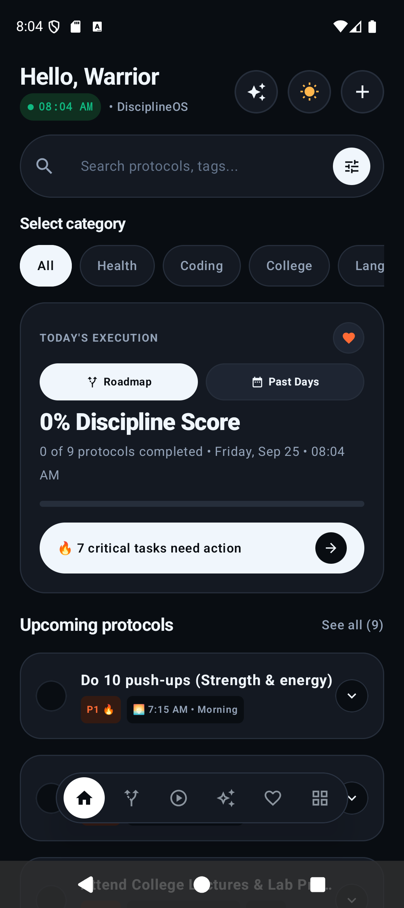
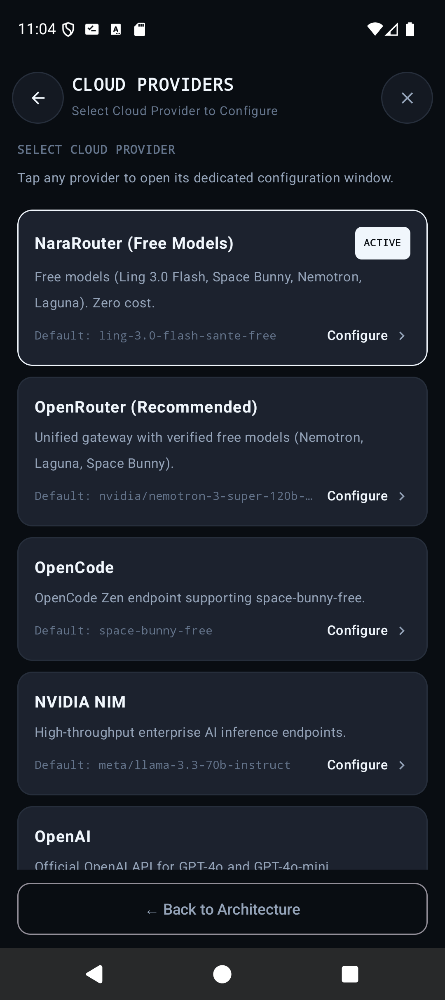
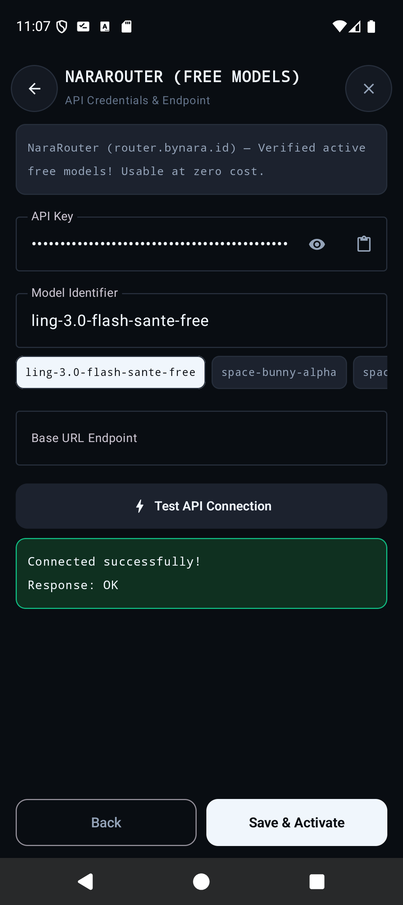
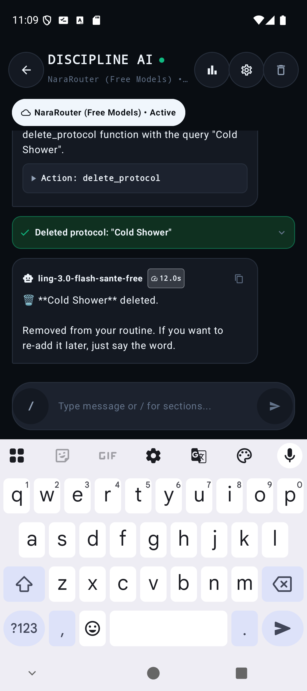
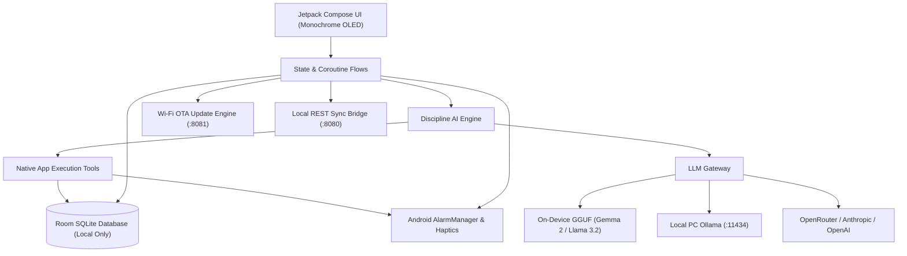

<div align="center">


# DisciplineOS
### *The Sovereign High-Performance Protocol Engine & On-Device AI Operating System*

[](https://android.com)
[](https://kotlinlang.org)
[](https://developer.android.com/jetpack/compose)
[](#-discipline-ai-autonomous-on-device-agent)
[-FFCA28?style=for-the-badge&logo=sqlite&logoColor=black)](https://developer.android.com/training/data-storage/room)
[](#-in-app-wi-fi-ota-auto-update-engine)
[](#-what-disciplineos-does-not-have)

<br/>

**DisciplineOS** is an unapologetic, military-grade routine execution system and on-device AI assistant engineered for individuals who reject excuses and demand radical daily execution. It transforms your smartphone into a disciplined focus terminal—free from commercial bloat, subscription paywalls, and dopamine traps.

</div>

---

## 🎯 Why We Made DisciplineOS (The Philosophy)

Modern app stores are flooded with "habit trackers" that are engineered backwards:
1. **Dopamine Traps disguised as productivity:** Gamified badges, cartoon animations, and social feeds keep users addicted to looking at the screen rather than doing the actual work.
2. **Surveillance & Cloud Telemetry:** Commercial apps monetize your behavioral weaknesses, sell your activity patterns to data brokers, and force cloud accounts.
3. **Passive Checklists with Zero Muscle:** Standard to-do apps sit silently in the background while you succumb to brain fog and distractions.
4. **Subscription Extortion:** Charging \$10/month just to set recurring reminders or view 7-day analytics.

**DisciplineOS was engineered with an opposite thesis:**
* **Identity Over Motivation:** Motivation is fleeting and fickle. Discipline is systematic identity. DisciplineOS treats your day as an immutable flight checklist that you execute without negotiation.
* **On-Device Data Sovereignty:** Your daily vows, private reflections, habit completion rates, and learning paths belong to you. Zero bytes leave your phone unless you intentionally ping an external LLM.
* **Dopamine Shield Architecture:** Stark obsidian monochrome styling, zero colorful gamification badges, zero ads, zero short-form video feeds. Every pixel is crafted to calm the nervous system and protect your prefrontal cortex.
* **Hardware-Level Enforcers:** High-potential rapid vibration haptics that break through sleep inertia and physical lethargy without sounding annoying alarms in public.

---

## 📱 Complete Visual Gallery & UI Showcase

Every screen in DisciplineOS is handcrafted with Jetpack Compose, edge-to-edge system window insets, dynamic 3-button and gesture navigation clearance, and high-contrast OLED black themes:

<div align="center">
<table>
  <tr>
    <td align="center" width="33%">
      <b>🌅 01. Chronological Protocols</b><br/><br/>
      <br/>
      <i>Strict chronological timeline with capsule navigation dock, daily discipline score, and minute-precision execution sequencing.</i>
    </td>
    <td align="center" width="33%">
      <b>🤖 02. Discipline AI Autonomous Agent</b><br/><br/>
      <br/>
      <i>Autonomous on-device AI with native function calling: mutates SQLite database, schedules alarms, and audits performance.</i>
    </td>
    <td align="center" width="33%">
      <b>🗺️ 03. Divided Multi-Track Roadmaps</b><br/><br/>
      <br/>
      <i>Categorized long-term progression tracks (Calisthenics Mastery, Systems Architecture) with milestone checklists.</i>
    </td>
  </tr>
  <tr>
    <td align="center" width="33%">
      <b>🧠 04. Tiny Mobile Models Catalog</b><br/><br/>
      <br/>
      <i>Run Google Gemma 2 2B and Meta Llama 3.2 1B/3B directly on device storage with one-tap configuration.</i>
    </td>
    <td align="center" width="33%">
      <b>⚙️ 05. AI Models & Cloud Gateway</b><br/><br/>
      <br/>
      <i>Multi-provider gateway: OpenRouter (free Gemini 2.0 Flash), OpenAI, Anthropic Claude, Ollama LAN, and custom endpoints.</i>
    </td>
    <td align="center" width="33%">
      <b>📊 06. Past Days & Compounding Audit</b><br/><br/>
      <br/>
      <i>Permanent daily compounding discipline audit: historical execution scores, completed protocol logs, and streak tracking.</i>
    </td>
  </tr>
  <tr>
    <td align="center" width="33%">
      <b>⏰ 07. Luxury Clock Studio</b><br/><br/>
      <br/>
      <i>Edge-to-edge live digital clock with routine presets (05:27 AM, Bedtime), 12h/24h conversion, and haptic feedback.</i>
    </td>
    <td align="center" width="33%">
      <b>🎬 08. Video Knowledge Vault</b><br/><br/>
      <br/>
      <i>Curated video study engine: save tutorials via Android Share Intent, schedule study reminders, and track mastery.</i>
    </td>
    <td align="center" width="33%">
      <b>🔥 09. Fuel & Defiance Mode</b><br/><br/>
      <br/>
      <i>The "Prove Them Wrong" vault: convert doubters, skeptics, and past setbacks into unrelenting compounding execution.</i>
    </td>
  </tr>
  <tr>
    <td align="center" width="33%">
      <b>📳 10. Rapid Vibration System</b><br/><br/>
      <br/>
      <i>Silent, high-intensity haptic vibration pulses with diagnostic testing sweeps.</i>
    </td>
    <td align="center" width="33%">
      <b>🚀 11. Wi-Fi In-App Auto-Update</b><br/><br/>
      <br/>
      <i>Instant over-the-air firmware updates: release notes, live download bar, and one-tap Android installer.</i>
    </td>
    <td align="center" width="33%">
      <b>🛡️ 12. Digital Dopamine Shield</b><br/><br/>
      <br/>
      <i>Built for deep work, mental toughness, and unrelenting focus on high-leverage goals.</i>
    </td>
  </tr>
  <tr>
    <td align="center" width="33%">
      <b>🌐 13. Free Multi-Cloud AI Gateway</b><br/><br/>
      <br/>
      <i>Zero-cost verified model gateway: NaraRouter (Ling 3.0 Flash, Space Bunny), OpenRouter (Nemotron, Laguna), and OpenCode.</i>
    </td>
    <td align="center" width="33%">
      <b>⚡ 14. Live Diagnostic & Model Chips</b><br/><br/>
      <br/>
      <i>Instant connection latency test, status indicator, and one-tap model suggestion chips.</i>
    </td>
    <td align="center" width="33%">
      <b>🎯 15. Context-Aware Autonomous Actions</b><br/><br/>
      <br/>
      <i>Accurate, zero-hallucination structured tool execution for protocol creation, modification, and context deletion.</i>
    </td>
  </tr>
</table>
</div>

---

## ✨ What DisciplineOS Has (Complete Architecture)

### 1. 🤖 Discipline AI Autonomous On-Device Agent
* **Native Structured Tool Calling:** The AI agent isn't a passive chatbot. It directly executes actions against the local Room SQLite database:
  * `add_protocol`: Adds a new time-anchored protocol to the schedule.
  * `toggle_protocol`: Toggles completion state with instant rapid vibration.
  * `delete_protocol`: Safely deletes protocols with relative context awareness ("delete the task you just added").
  * `add_fuel` & `delete_fuel`: Records or purges defiance vows from the Prove Them Wrong vault.
  * `create_full_roadmap`: Synthesizes multi-step technical or fitness roadmaps with structured milestones.
  * `delete_roadmap_step`: Removes milestones from active tracks.
  * `get_daily_protocols` & `get_past_history`: Audits past discipline scores and schedules.
* **Verified Free Models & Multi-Provider Gateway:** Out-of-the-box support for NaraRouter (`ling-3.0-flash-sante-free`, `space-bunny-alpha`, `laguna-s-2.1`), OpenRouter (`nvidia/nemotron-3-super-120b-a12b:free`, `stealth/space-bunny-alpha`), OpenCode (`space-bunny-free`), and On-Device GGUF (Gemma 2 2B, Llama 3.2 1B).
* **Tag Sanitization & Robust Null Handling:** Built-in output filter strips raw thinking tags (`<think>`, `</role>`) and handles OpenAI JSON null payloads seamlessly.
* **Top Horizontal Model Switcher Bar:** Instantly hot-swap between active on-device GGUF models and cloud endpoints directly from the chat header.
* **Smart Slash Commands (`/`):** Type `/` in the chat bar to trigger quick action suggestions for `/protocol`, `/roadmap`, `/fuel`, and `/history`.
* **Universal General Knowledge:** Answers coding, systems architecture, fitness, and philosophy questions with direct, concise clarity.

### 2. 🗺️ Divided Multi-Track Roadmaps (Long-Term Mastery)
* **Track Division & Switcher:** Seamlessly switch between distinct progression domains (e.g. *Fitness: Your CALISTHENICS Journey* vs *Engineering: Low-Level Systems & Deep Work Architecture*).
* **Granular Milestone Checklists:** Every roadmap phase contains concrete criteria and subtasks (e.g., Wall Push-ups -> Incline -> Negative Pull-ups -> Freestanding Handstand -> Clean Muscle-up).
* **AI Roadmap Generator:** Tell Discipline AI *"design roadmap for Rust & WebAssembly"* and it autonomously builds the entire track into SQLite.

### 3. 🌅 Strict Chronological Protocol Pipeline
* **Natural Minute Sequencing:** Routines are strictly sorted chronologically (e.g., 07:15 AM Physical Readiness -> 07:30 AM Deep Work Coding -> 08:45 AM Core Technical Study).
* **Dopamine Shield Category Filters:** Filter by `Health`, `Coding`, `Study`, `Engineering`, `Language`, `Security`, and `Bedtime`.
* **One-Tap Subtask Progress:** Expand protocols to check off subtasks with real-time percentage updates.

### 4. ⏰ Luxury Digital Clock Studio
* **Edge-to-Edge OLED Canvas:** Displays live system hours, minutes, and AM/PM with zero screen bleed.
* **Instant Routine Chips:** Fast selection presets for early morning alarms (05:27 AM), workouts (07:15 AM), and bedtime wind-down (10:00 PM).
* **System Navigation Inset Intelligence:** Fully responsive to both gesture bars and 3-button navigation overlays.

### 5. 🎬 Video Knowledge Vault & Study Engine
* **Android System Share Intent:** Share YouTube tutorial URLs directly into DisciplineOS from YouTube or web browsers.
* **Scheduled Study Alarms:** Set rapid vibration reminders for study sessions ("Tonight 8:00 PM", "Tomorrow Morning").
* **Curated Presets:** Pre-seeded with Calisthenics bodyweight mastery, low-level C programming, and security auditing foundations.

### 6. 🔥 Fuel & Defiance Mode ("Prove Them Wrong")
* **Emotional Alchemy:** Convert skepticism, doubts from others, and personal frustrations into unyielding daily momentum.
* **Defiance Cards:** Categorized by `Doubter`, `Critic`, `Skeptic`, `Rival`, and `Personal Vow`.

### 7. 📳 Silent Rapid Vibration Hardware Engine
* **Tactile Wake-Up Pulses:** Uses Android `Vibrator` and `VibrationEffect` at maximum amplitude to signal task transitions silently.
* **Built-in Diagnostic Sweep:** Test hardware haptics directly from System Settings.

### 8. 🚀 In-App Wi-Fi Auto-Update Engine (OTA Hub)
* **Zero-Play-Store Private Updates:** Over-the-air firmware updates streamed directly over local Wi-Fi from your development PC.
* **Native Package Installer:** Uses secure `FileProvider` URIs to trigger Android's native package installer with one tap.

---

## 🚫 What DisciplineOS Does NOT Have

| Feature | DisciplineOS | Commercial Habit Apps |
| :--- | :---: | :---: |
| **Advertisements** | ❌ **ZERO** | ⚠️ Fullscreen popups & banners |
| **Cloud Tracking & Telemetry** | ❌ **ZERO** | ⚠️ Analytics, Firebase, Mixpanel |
| **Subscription Paywalls** | ❌ **ZERO** | ⚠️ \$9.99/month or \$59/year |
| **Mandatory Account Creation** | ❌ **ZERO** | ⚠️ Email, phone number, Google login |
| **Social Doomscrolling Feeds** | ❌ **ZERO** | ⚠️ Community forums, likes, feeds |
| **Gamified Cartoon Clutter** | ❌ **ZERO** | ⚠️ Pet avatars, candy animations |
| **Data Selling to Brokers** | ❌ **ZERO** | ⚠️ Monitored behavior profiles |

---

## 📖 How To Use DisciplineOS

### 1. Daily Protocol Flow
1. Open DisciplineOS in the morning.
2. Review your chronological flight checklist:
   * **07:15 AM:** Morning Physical Readiness & Mobility
   * **07:30 AM:** Deep Work: Systems & Architecture (1 Hour)
   * **08:45 AM:** Core Technical Deep Study & Lab Practice
   * **05:27 PM:** Engineering Review & Project Implementation
   * **06:30 PM:** Cognitive Expansion & Language Acquisition
   * **08:27 PM:** Cyber Security & Systems Auditing
   * **10:00 PM:** Compounding Daily Reflection (1% Better)
   * **All Day:** Digital Dopamine Shield (Focus Lock)
3. Tap the circle on any completed protocol to trigger the high-intensity completion haptic.

### 2. Using Discipline AI (Voice & Text)
* Tap the ✨ Sparkles tab in the bottom dock.
* **Add a routine:** *"Add a task today at 4:30 pm to run 5 kilometers"*
* **Mark complete:** *"Mark morning physical readiness done"*
* **Delete relative:** *"Delete the task you just created"*
* **Build a roadmap:** *"Design roadmap for bare-metal assembly programming"*
* **Log fuel:** *"In fuel section: a critic told me I'd never master low-level systems"*
* **Delete fuel:** *"/fuel delete critic"*
* **Ask general questions:** *"Explain the difference between stack and heap in C"*

### 3. Setting Up On-Device Tiny Models
1. Tap the ⚙️ Settings gear in the AI chat header.
2. Download any lightweight `.gguf` model (e.g. Google Gemma 2 2B or Meta Llama 3.2 1B).
3. Place it in your phone's `Downloads` folder or use the in-app Model Downloader.
4. Select the model from the **Top Switcher Bar** for 100% offline, zero-latency inference.

### 4. Over-The-Air (OTA) Wi-Fi Firmware Updates
To update your phone without connecting a USB cable:
```bash
# 1. On your PC, build and publish a new version
python scripts/publish_update.py --bump patch --release-notes "Added new roadmap track & haptic improvements"

# 2. Start the local OTA Wi-Fi server
python -m http.server 8081 --directory ~/Desktop

# 3. Open DisciplineOS on your phone (connected to same Wi-Fi)
# An instant "Update Available" modal will appear with one-tap installation!
```

---

## 🛠️ Architecture & Tech Stack



* **OS Platform:** Android 8.0+ (API 26 to API 35+)
* **Programming Language:** 100% Kotlin 2.0
* **UI Framework:** Jetpack Compose & Material 3 (Obsidian Dark / Crisp Light Design System)
* **Local Database:** Room SQLite with automatic schema migration and deduplication
* **Asynchronous Engine:** Kotlin Coroutines & StateFlow
* **Haptics:** Android Hardware Vibrator API with custom waveform effects
* **OTA Delivery:** Custom HTTP Cleartext client with Android `FileProvider` package installer integration

---

## 📥 Building From Source

### Prerequisites
* Android Studio Ladybug / Koala or Android SDK Command-Line Tools
* JDK 21+
* Android device or emulator running Android 8.0+ (API 26+)

### Build APK
```bash
# Clone the repository
git clone https://github.com/Developer-For-Git/DisciplineOS.git
cd DisciplineOS

# Compile and package debug APK
./gradlew assembleDebug
```
The compiled APK will be at:
```text
app/build/outputs/apk/debug/app-debug.apk
```

### Install via ADB
```bash
adb install -r app/build/outputs/apk/debug/app-debug.apk
```

---

## 🔮 Future Roadmap

- [ ] **WearOS Companion Module:** Silent wrist haptics and protocol checklists synced with the mobile terminal.
- [ ] **Camera AI Posture & Form Analyzer:** Local on-device vision model verifying clean push-up and pull-up depth.
- [ ] **Encrypted P2P Backup:** Offline mesh synchronization between personal laptop and smartphone over local Wi-Fi.
- [ ] **Hardware NFC Discipline Tags:** Tap a physical NFC tag on your desk or pull-up bar to mark protocols complete.

---

## 🔒 Privacy Guarantee

DisciplineOS contains **zero proprietary analytics**, **zero trackers**, and **zero user telemetry**. Your routines, defiance vows, and personal history are stored solely in local SQLite databases on your physical hardware. You own your data, your focus, and your daily execution.

---

<div align="center">
  <sub>Engineered for uncompromising high performance by <b>Developer-For-Git</b></sub>
</div>
